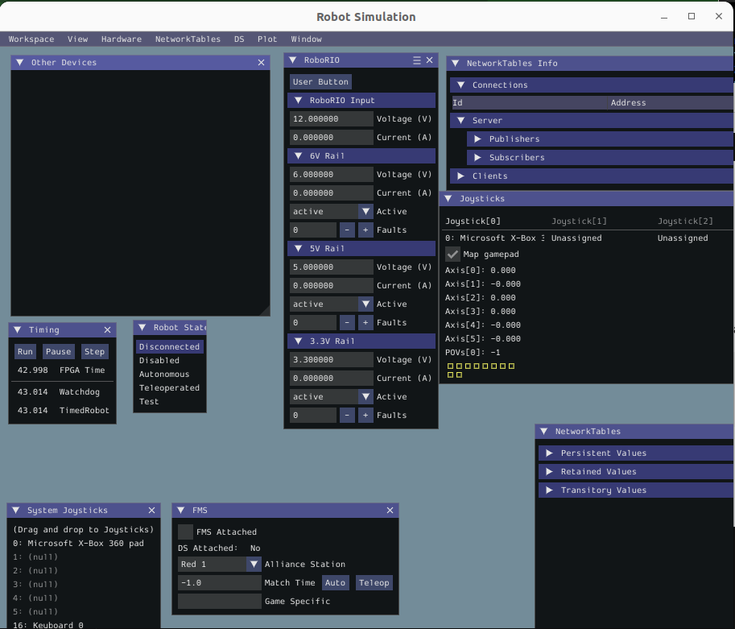

# Bot 2024

## Driver Station Tuning & Deployment
* [Flashing the OS](https://docs.wpilib.org/en/stable/docs/zero-to-robot/step-3/imaging-your-roborio.html)
* [Deployment Info](https://docs.wpilib.org/en/stable/docs/software/vscode-overview/deploying-robot-code.html#building-and-deploying-robot-code)
* [Driver Station Best Practices](https://frcdocs.wpi.edu/en/2022/docs/software/driverstation/driver-station-best-practices.html)

## Example Code

FRC provides [several examples](https://github.com/wpilibsuite/allwpilib/tree/main/wpilibcExamples/src/main/cpp/examples) of how to utilize WPIlib on GitHub.  It is easier, and faster to copy and paste from these rather than generate new projects all the time.

* [All cpp Examples](https://github.com/wpilibsuite/allwpilib/tree/main/wpilibcExamples/src/main/cpp/examples)

## Differential Drive Help

* [PWM Controllers](https://docs.wpilib.org/en/stable/docs/software/hardware-apis/motors/pwm-controllers.html)
* [Drive classes](https://docs.wpilib.org/en/stable/docs/software/hardware-apis/motors/wpi-drive-classes.html)

## Building
Build all targets, and run the simulator.
```bash
./gradlew build
```

## Deployment
Run the following command to deploy code to the roboRIO
```bash
./gradlew deploy
```

If it gives problems, cleaning the project could help. The `--info` option could give more information too.
```bash
./gradlew clean
./gradlew deploy --info

```

## Simulation
Bot simulation is available in a few ways...

**IMPORTANT**: The `Map gamepad` in the controllers list must be checked to mock the real bot.

### Basic Simulator
This is the data-based simulator panel.

```bash
# run this from the command line to start the basic simulator
./gradlew simulateNative
```



